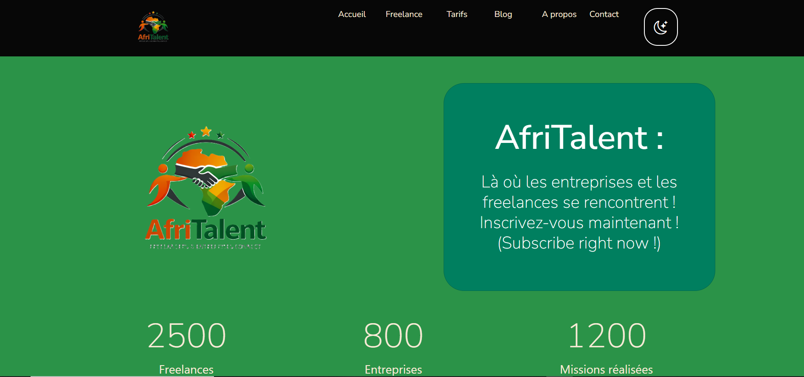
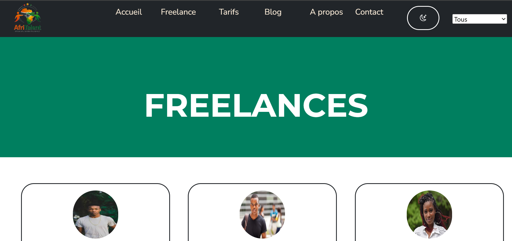
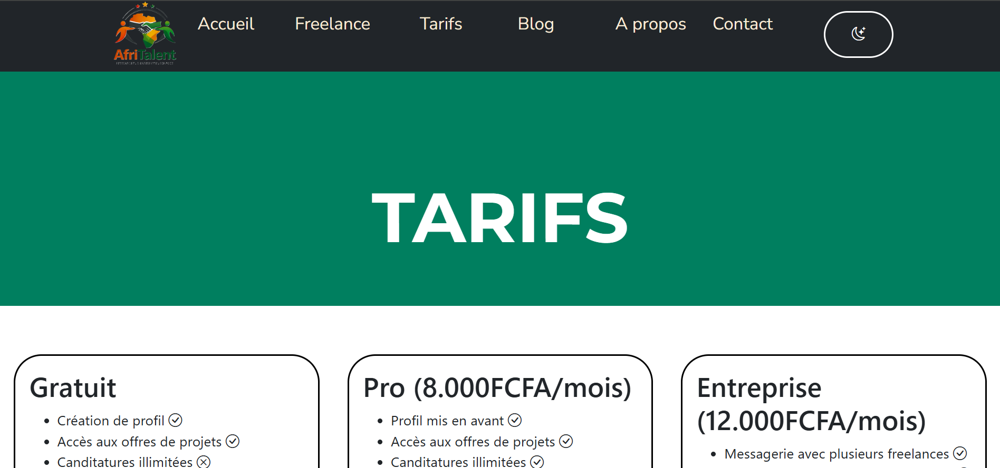
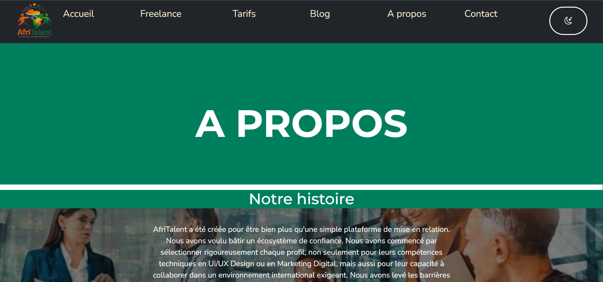
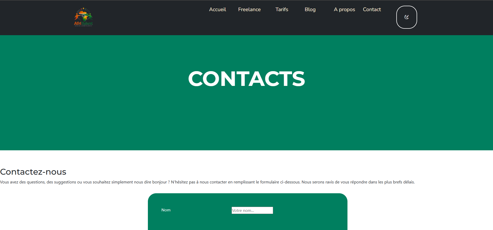

# AfriTalent

## À propos

AfriTalent est une plateforme web ayant pour objectif de mettre en lumière les compétences africaines en facilitant la rencontre entre les talents et les entreprises.

Grâce à une interface moderne, intuitive et responsive, la plateforme permet aux utilisateurs de :

- découvrir des profils talentueux ;
- consulter des offres d'emploi ;
- publier leurs compétences ;
- faciliter le recrutement de profils qualifiés.

Le projet répond au manque de visibilité dont souffrent de nombreux talents africains sur le marché de l'emploi.

---

## Objectifs

- Valoriser les compétences africaines.
- Faciliter le recrutement.
- Créer une communauté professionnelle.
- Promouvoir l'emploi en Afrique.
- Offrir une plateforme simple, rapide et accessible.

---

## Fonctionnalités

- Page d'accueil moderne
- Présentation des talents
- Consultation des offres d'emploi
- Design Responsive
- Mode sombre / Mode clair
- Navigation fluide
- Interface utilisateur intuitive
- Animations et effets CSS
- Chiffres clés
- Formulaire de contact

---

## Technologies utilisées

### Front-end

- HTML5
- CSS3
- JavaScript

### Outils

- Git
- GitHub
- Visual Studio Code

### Bibliothèques

- Bootstrap Icons
- Google Fonts

---

## Structure du projet

MOUELE_Pascal-AfriTalent
|   .gitignore
|   about.html
|   arborescence.txt
|   contacts.html
|   freelances.html
|   index.html
|   README.md
|   tarifs.html
|   
|---CSS
|       style.css
|       
|---docs
|---images
|       26389178-groupe-de-affaires-gens-avoir-une-reunion-a-propos-entreprise-statistiques-photo.jpg
|       AfriTalent.png
|       AfriTalent_No_background.png
|       Benazo_Danel.png
|       Christelle_Mouithyss.png
|       Dorcas_Mouyabi.png
|       Elischeba_Mouithys.png
|       Emmanuel_Josiah.png
|       Junior_Malela.png
|       J‚r‚my_Samba.png
|       Keisha_Mouele.png
|       Makny_Nzoulou.png
|       Pascal_Céleste.png
|       Syntyche_Moulongo.png
|       Tony_Ikounga.png
|       
|---JS
        main.js

---

## Utilisation

1. Accéder à la page d'accueil.
2. Parcourir les différentes sections.
3. Découvrir les talents disponibles.
4. Consulter les offres.
5. Utiliser le mode sombre selon les préférences.
6. Contacter l'équipe via le formulaire.

---

## Responsive Design

La plateforme est optimisée pour :

- 💻 Ordinateurs
- 💼 Laptops
- 📱 Smartphones
- 📟 Tablettes

---

## Fonctionnalités UI/UX

- Navigation fluide
- Design moderne
- Icônes Bootstrap
- Typographie Google Fonts
- Animations CSS
- Bouton retour en haut
- Thème clair/sombre
- Effets de survol
- Sections organisées

---

## Aperçu

### Accueil

### Freelances

### A propos & Blog

### Tarifs

### Contacts

---

## Sécurité

Le projet respecte les bonnes pratiques suivantes :

- Code organisé
- Structure claire
- Fichiers séparés
- JavaScript non intrusif
- Responsive Design
- Accessibilité améliorée

---

## Perspectives d'amélioration

- Authentification des utilisateurs
- Tableau de bord personnel
- Publication d'offres d'emploi
- Candidature en ligne
- Recherche avancée
- Chat entre recruteurs et talents
- Notifications
- Géolocalisation
- API backend
- Base de données
- Tableau d'administration
- Système de recommandations par IA
- Application mobile

---

## Auteur

**Pascal Céleste**

Étudiant en L1 - Data Science à ISI

---

## Contact

Email : keishamouele@gmail.com

GitHub : https://github.com/votre-utilisateur

---

# AfriTalent

**Là où les entreprises et les freelances se rencontrent**